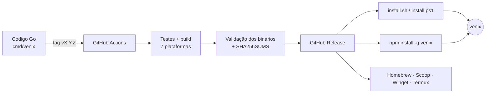

<div align="center">


<br>

[](https://github.com/LLGGJ/venix-cli/releases)
[](https://github.com/LLGGJ/venix-cli/actions)


**Gerencie suas aplicações na VenixCloud sem sair do terminal.**

[Instalação](#-instalação) · [Primeiros passos](#-primeiros-passos) · [Comandos](#-comandos) · [Como funciona](#-como-funciona) · [Linguagens](#-linguagens-e-o-que-cada-uma-faz) · [Desenvolvimento](#-desenvolvimento)

<br>



<sub>Animação ilustrativa com dados de exemplo.</sub>

</div>

---

## ✨ Destaques

| | |
|---|---|
| ⚡ **Binário nativo em Go** | Um único executável, sem runtime para instalar. |
| 📱 **Funciona no Termux** | Build Android dedicado (arm64) e interface adaptada a telas pequenas. |
| 🖥️ **Menu interativo ao vivo** | `venix apps` atualiza status, CPU e memória sozinho a cada poucos segundos. |
| 🩺 **Diagnóstico embutido** | `venix doctor` verifica versão, login, API, PATH e se o navegador abre. |
| 🔐 **Login seguro** | OAuth2 com PKCE: sem `client_secret` e sem senha no terminal. |
| 📦 **Instalação verificada** | Todo download confere o SHA-256 publicado na release. |

## 📦 Instalação

<details open>
<summary><b>Instalador de uma linha</b> — Linux, macOS e Termux (sem npm)</summary>

```bash
curl -fsSL https://raw.githubusercontent.com/LLGGJ/venix-cli/main/install.sh | sh
```

Detecta o sistema, baixa o binário certo, confere o SHA-256 e instala em `$PREFIX/bin` (Termux), `/usr/local/bin` ou `~/.local/bin`. Para fixar uma versão: `VENIX_VERSION=1.0.16 sh install.sh`.

</details>

<details>
<summary><b>Windows</b> — PowerShell</summary>

```powershell
irm https://raw.githubusercontent.com/LLGGJ/venix-cli/main/install.ps1 | iex
```

Instala em `%LOCALAPPDATA%\Programs\venix` e adiciona ao PATH do usuário.

</details>

<details>
<summary><b>npm</b> — Linux, macOS, Windows e Termux</summary>

O pacote npm é só um instalador: baixa o binário nativo da release de mesma versão e verifica `--version`.

```bash
# Termux: pkg update && pkg install nodejs tar
npm install -g venix
```

Se o seu npm não executa scripts de instalação, o binário é baixado na primeira execução do `venix`.

</details>

<details>
<summary><b>Homebrew · Scoop · Winget · pacote do Termux</b> — manifestos prontos</summary>

A cada release o CI gera os manifestos desses gerenciadores (arquivo `packaging_<versão>.tar.gz` na página da release). A publicação nos repositórios oficiais ainda é manual, então por enquanto use as opções acima.

| Gerenciador | Situação |
|---|---|
| Homebrew | Fórmula gerada; falta publicar em um tap |
| Scoop | Manifesto gerado; falta publicar em um bucket |
| Winget | Manifestos gerados; falta enviar PR ao `winget-pkgs` |
| Termux (`pkg install venix`) | `build.sh` gerado; falta enviar PR ao `termux-packages` |

</details>

<details>
<summary><b>Download manual</b></summary>

Baixe o arquivo do seu sistema em [Releases](https://github.com/LLGGJ/venix-cli/releases), confira com o `SHA256SUMS` e coloque o executável `venix` no `PATH`.

</details>

### Plataformas suportadas

| Sistema | Arquiteturas | Arquivo da release |
|---|---|---|
| 🐧 Linux | amd64 · arm64 | `venix_<versão>_linux_<arch>.tar.gz` |
| 🍎 macOS | amd64 · arm64 | `venix_<versão>_darwin_<arch>.tar.gz` |
| 🪟 Windows | amd64 · arm64 | `venix_<versão>_windows_<arch>.zip` |
| 🤖 Android / Termux | arm64 | `venix_<versão>_android_arm64.tar.gz` |

## 🚀 Primeiros passos

```bash
venix --version     # confere a instalação
venix login         # abre o navegador e autoriza a CLI
venix apps          # lista suas aplicações (menu interativo)
venix doctor        # algo estranho? rode o diagnóstico
```

- O `venix login` abre o navegador sozinho (no Termux usa `termux-open-url`). Em SSH ou sem navegador, use `venix login --no-browser`.
- As credenciais ficam em `~/.config/venix/credentials.json`, com permissão restrita.
- `venix` e `venix help` mostram a ajuda e abrem [venixcloud.com/en/tools](https://venixcloud.com/en/tools) em terminais interativos. Defina `VENIX_NO_OPEN=1` para desativar.

## 🧭 Comandos

| Comando | O que faz |
|---|---|
| `venix login` / `logout` / `whoami` | Autoriza, encerra e mostra a sessão |
| `venix apps` | Lista aplicações em um menu interativo **ao vivo** |
| `venix up [nome]` | Cria uma aplicação a partir do diretório atual |
| `venix push [app]` | Envia arquivos, extrai e reinicia |
| `venix link [app]` | Vincula o diretório a uma aplicação |
| `venix start` · `stop` · `restart [app]` | Controla a aplicação |
| `venix logs [app] [-f]` | Mostra ou acompanha os logs |
| `venix backup [app]` | Cria um snapshot |
| `venix deploy [app]` | Dispara um deploy |
| `venix ram [app] <mb>` | Altera a memória |
| `venix delete [app]` | Exclui uma aplicação |
| `venix doctor` | Diagnostica instalação, login, API e navegador |

O agrupamento `venix app <comando>` também existe. Para scripts, use `--json` (por exemplo, `venix apps --json`).

### Menu `venix apps`

- Atualiza **sozinho a cada 5 segundos**, mantendo a seleção.
- Mostra status colorido (`● ONLINE`, `● OFFLINE`, `● INICIANDO`...) e uso de CPU e memória, quando a API informar.
- Layout **responsivo**: tabela em telas largas e lista empilhada em telas estreitas, como as do Termux.
- Navegação: `↑` `↓` ou `j` `k`, `Enter` para escolher e `Esc` para sair. As ações (iniciar, parar, excluir...) têm cores próprias.

### `venix doctor`

Mostra, em um comando, versão, caminho do executável, ambiente (Termux, terminal), `PATH`, pasta de configuração, login, conectividade com o site e a API, porta do login e quais programas podem abrir o navegador. Use `--open-test` para tentar abrir o navegador de verdade e `--json` para automação.

## 🛠️ Como funciona



A **tag Git é a única fonte da versão**: o Go recebe o número por `-ldflags` e o pacote npm é publicado com o mesmo número. Nada precisa ser editado à mão a cada release.

## 🧩 Linguagens e o que cada uma faz

| Linguagem | Onde fica | Para que serve |
|---|---|---|
| **Go** | `cmd/`, `internal/` | O coração do projeto: comandos, menu interativo, login OAuth2 + PKCE, cliente HTTP da API, diagnóstico e build do executável nativo. |
| **JavaScript (Node.js)** | `npm-package/` | Só o instalador do npm: baixa o binário certo da release, confere o SHA-256 e encaminha os argumentos para o `venix`. |
| **Shell (sh/bash)** | `install.sh`, `scripts/release/` | Instalador de uma linha e scripts de release (conferência de nomes, checksums, manifestos). |
| **PowerShell** | `install.ps1` | Instalador de uma linha para Windows. |
| **Python** | `scripts/release/check_binary.py` | Valida no CI o formato e a arquitetura de cada binário antes de publicar. |
| **YAML** | `.github/workflows/`, `packaging/` | Pipeline do GitHub Actions e manifestos do Winget. |
| **HTML + CSS** | `internal/auth/page.go` | Página exibida no navegador depois de confirmar o login. |
| **JSON** | `.github/release-targets.json`, `package.json` | Lista das plataformas da release e metadados do pacote npm. |
| **Makefile** | `Makefile` | Atalhos de desenvolvimento (`make fmt`, `make test`, `make build`). |
| **Ruby (modelo)** | `packaging/homebrew/` | Modelo da fórmula do Homebrew. |

## 🗂️ Estrutura do repositório

```text
venix-cli/
├── cmd/venix/            # comandos da CLI (main, apps, doctor, login, help)
├── internal/
│   ├── api/              # cliente HTTP da VenixCloud
│   ├── auth/             # OAuth2 + PKCE e página de callback
│   ├── browser/          # abre o navegador (inclui Termux)
│   ├── menu/             # menu interativo responsivo e ao vivo
│   ├── output/           # cores, tabelas, logs e JSON coloridos
│   └── store/            # credenciais locais
├── npm-package/          # instalador npm (JavaScript)
├── packaging/            # modelos Homebrew, Scoop, Winget e Termux
├── scripts/release/      # validação e geração de artefatos
├── .github/workflows/    # CI e release automática
├── install.sh            # instalador Linux, macOS e Termux
└── install.ps1           # instalador Windows
```

## 👩‍💻 Desenvolvimento

Requisitos: Go 1.22 ou superior e Make.

```bash
make fmt     # formata o código
make test    # roda os testes
make build   # gera dist/venix
./dist/venix --version
```

### Publicar uma release

Basta enviar uma tag de versão:

```bash
git tag v1.0.16
git push origin v1.0.16
```

O GitHub Actions testa, compila as 7 plataformas, valida cada binário, gera o `SHA256SUMS`, publica a release e, por fim, o pacote npm (Trusted Publishing ou o secret `NPM_TOKEN`). Detalhes em [`GITHUB-AUTOMATICO.md`](GITHUB-AUTOMATICO.md).

## 🔒 Segurança

- Login com OAuth2 + PKCE; nenhum segredo fica no código.
- Instaladores (`install.sh`, `install.ps1` e npm) conferem o SHA-256 antes de instalar e executam `--version` para validar o binário.
- Nunca envie tokens, chaves ou credenciais para o repositório.

---

<div align="center">
<sub>Feito com Go · <a href="https://venixcloud.com">venixcloud.com</a></sub>
</div>
